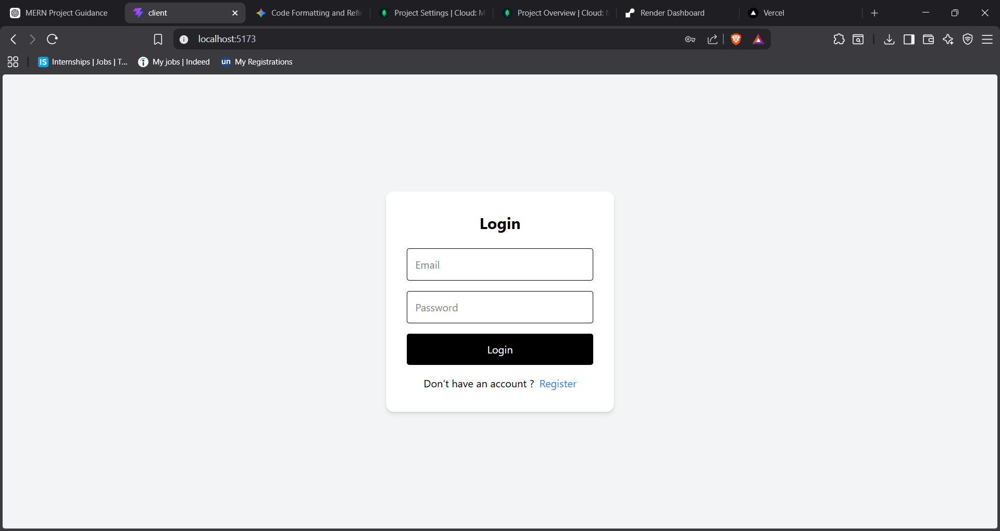
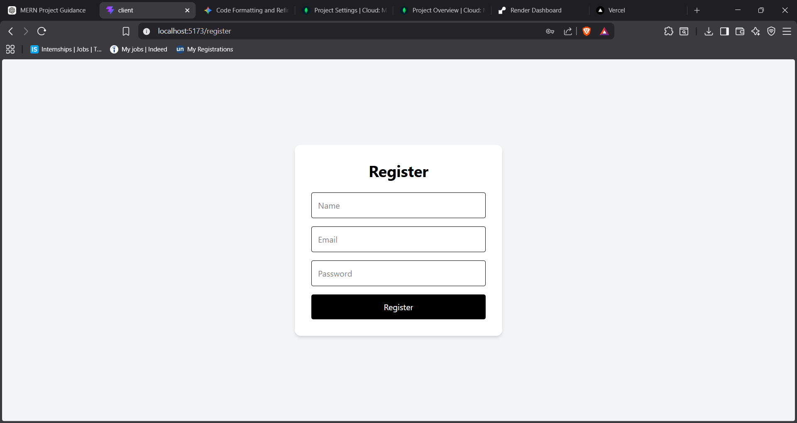
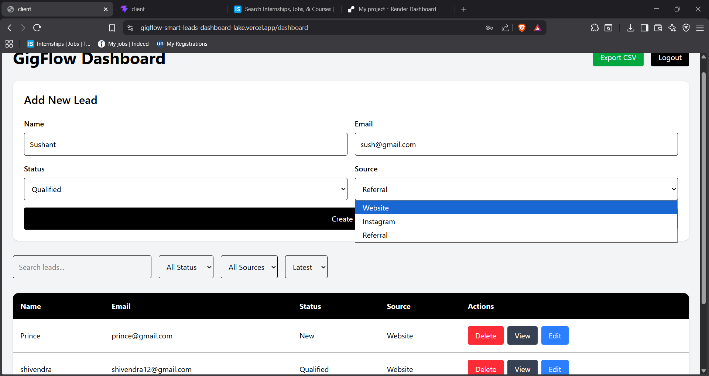

---

# 🚀 GigFlow – Smart Leads Dashboard


A full-stack lead management dashboard built using the MERN stack.

GigFlow enables teams to securely manage leads, authenticate users, apply advanced filtering, pagination, CSV export, and perform role-based operations through a clean and responsive dashboard interface.

---

# 🌐 Live Demo

## Frontend

[GigFlow Frontend](https://gigflow-smart-leads-dashboard-lake.vercel.app/)

## Backend API

[GigFlow Backend API](https://gigflow-smart-leads-dashboard-4ybk.onrender.com/)

---

# ✨ Features

## 🔐 Authentication

* User Registration
* User Login
* JWT Authentication
* Protected Routes
* Persistent Login Sessions

---

## 👥 Role-Based Access Control

### Admin

* Create Leads
* Update Leads
* Delete Leads
* View Leads

### Sales

* View Leads Only

---

## 📋 Lead Management

* Create Leads
* Update Leads
* Delete Leads
* View Single Lead Details
* Search Leads
* Filter Leads
* Sort Leads
* Pagination Support

---

## ⚡ Additional Features

* Debounced Search
* CSV Export
* Responsive Dashboard UI
* Loading & Empty States
* Zod Validation
* Docker Support

---
# 📸 Screenshots





---

# 🛠️ Tech Stack

## Frontend

* React
* TypeScript
* Tailwind CSS
* React Router DOM
* Vite

---

## Backend

* Node.js
* Express.js
* MongoDB
* Mongoose
* JWT Authentication
* bcryptjs
* Zod

---

# 🧠 Architecture

GigFlow follows a modern client-server architecture.

```text
Client (React + TypeScript)
            │
            ▼
REST API (Express.js)
            │
            ▼
MongoDB Database
```

Authentication Flow:

```text
User Login
     │
     ▼
JWT Token Generated
     │
     ▼
Protected API Requests
```

---

# 📦 Lead Schema

```json
{
  "name": "Rahul",
  "email": "rahul@gmail.com",
  "status": "Qualified",
  "source": "Instagram"
}
```

---

# 📂 Folder Structure

```text
gigflow-smart-leads-dashboard/
│
├── client/
│   ├── src/
│   │   ├── pages/
│   │   ├── components/
│   │   ├── App.tsx
│   │   └── main.tsx
│   └── Dockerfile
│
├── server/
│   ├── src/
│   │   ├── controllers/
│   │   ├── middlewares/
│   │   ├── models/
│   │   ├── routes/
│   │   ├── validators/
│   │   └── utils/
│   └── Dockerfile
│
├── docker-compose.yml
└── README.md
```

---

# 🔑 Environment Variables

## Backend `.env`

```env
PORT=5000

MONGO_URI=your_mongodb_uri

JWT_SECRET=your_jwt_secret
```

---

## Frontend `.env`

```env
VITE_API_URL=http://localhost:5000
```

---

# ⚙️ Installation & Setup

## Clone Repository

```bash
git clone https://github.com/sinjaa18/gigflow-smart-leads-dashboard.git

cd gigflow-smart-leads-dashboard
```

---

# 🖥️ Backend Setup

```bash
cd server

npm install

npm run dev
```

Backend runs on:

```txt
http://localhost:5000
```

---

# 💻 Frontend Setup

Open another terminal:

```bash
cd client

npm install

npm run dev
```

Frontend runs on:

```txt
http://localhost:5173
```

---

# 🐳 Docker Setup

Run the full project using Docker:

```bash
docker-compose up --build
```

Frontend:

```txt
http://localhost:5173
```

Backend:

```txt
http://localhost:5000
```

---

# 📡 API Endpoints

## 🔐 Auth Routes

### Register User

```http
POST /api/auth/register
```

### Login User

```http
POST /api/auth/login
```

---

## 📋 Lead Routes

### Get All Leads

```http
GET /api/leads
```

### Get Single Lead

```http
GET /api/leads/:id
```

### Create Lead

```http
POST /api/leads
```

### Update Lead

```http
PUT /api/leads/:id
```

### Delete Lead

```http
DELETE /api/leads/:id
```

---

# 🔎 Filtering & Search

## Search Leads

```txt
/api/leads?search=rahul
```

## Filter by Status

```txt
/api/leads?status=Qualified
```

## Filter by Source

```txt
/api/leads?source=Instagram
```

## Pagination

```txt
/api/leads?page=1
```

---

# 🔒 Security Features

* Password Hashing using bcryptjs
* JWT Authentication Middleware
* Protected Backend Routes
* Role-Based Authorization
* Zod Request Validation
* Secure REST API Architecture

---

# 🚀 Future Improvements

* Dashboard Analytics
* Dark Mode
* Activity Logs
* Lead Assignment System
* Email Notifications
* Real-time Updates
* Advanced Charts & Insights

---

# 📚 Learning Outcomes

This project demonstrates understanding of:

* Full-stack MERN architecture
* Authentication & Authorization
* REST API design
* MongoDB schema modeling
* Protected routing
* Pagination & filtering
* Role-based systems
* TypeScript backend/frontend integration
* Dockerized application setup

---

# 👨‍💻 Author

## Sintu Kumar

📧 Email: [santa143ns@gmail.com](mailto:santa143ns@gmail.com)

GitHub:

[sinjaa18 GitHub](https://github.com/sinjaa18)

LinkedIn:

[Sintu Kumar LinkedIn](https://www.linkedin.com/in/sintu-kumar-83350b324)

---

# ⭐ Support

If you found this project useful, consider giving the repository a star on GitHub.
